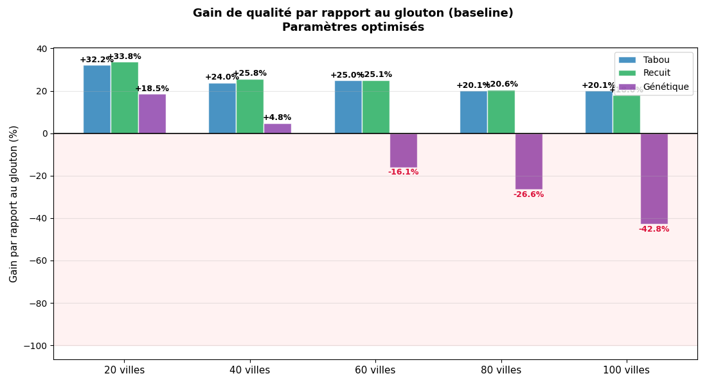

# VRPR — Vehicle Routing Problem with Restricted edges

[🇬🇧 English](#english) · [🇫🇷 Français](#français)

Operations Research project. We solve a multi-vehicle routing problem
on a road network with **forbidden roads** (impassable edges) and **surcharged
roads** (more expensive edges). From a single depot, every client must be visited
exactly once while minimising total travel cost.

---

## English

### Overview

A fleet of vehicles leaves a **depot** (node `0`), serves a set of clients and
returns to the depot. We look for the plan that **minimises total travel cost**.

Two business constraints extend the classic VRP — hence the name **VRPR**
(*VRP with Restricted edges*):

- **Closed roads** — some edges are impassable (`close = True`).
- **Surcharged roads** — some edges remain usable but cost more (`surcout = True`).

### Methods

1. **Instance generator** (`graph.py`) — random road network (k-nearest-neighbour
   or complete graph) with closed and surcharged edges.
2. **Greedy / GRASP initialiser** (`greedy.py`) — round-robin construction,
   randomised by a restricted candidate list (`k_rcl`).
3. **Metaheuristics**: tabu search (`tabu.py`), simulated annealing
   (`annealing.py`), genetic algorithm (`genetic.py`).
4. **OFAT experimental design** (`experiments.py`) — parameter tuning and
   comparison across instance sizes.

### Complexity

The VRP **generalises the Travelling Salesman Problem** and is therefore
**NP-hard** [[3]](#ref-3)[[5]](#ref-5). Exact solving is intractable beyond small instances, so we
rely on metaheuristics that return good approximate solutions in reasonable time.

### Result

In our full experimental study (10 instances per size, 20 to 100 cities,
tuned parameters), **tabu search and simulated annealing** are the most
robust approaches: both recover 20–32 % over the greedy baseline, converging
toward ~20 % on the largest instances. The **genetic algorithm** is
competitive on small instances (+18.5 % at 20 cities) but collapses as
instances grow, ending up *worse* than the greedy baseline itself (−43 % at
100 cities) under a fixed population size and generation budget. Simulated
annealing matches tabu search on solution quality but is far slower — two
orders of magnitude in the notebook's quick comparison (108 s vs 0.8 s at
30 cities) — making **multi-start tabu search** the best quality/time
trade-off overall.

---

## Français

### Présentation

Une flotte de véhicules part d'un **dépôt** (sommet `0`), dessert un ensemble de
clients et revient au dépôt. On cherche la planification qui **minimise le coût
total** des déplacements.

Deux contraintes métier s'ajoutent au VRP classique — d'où le nom **VRPR**
(*VRP with Restricted edges*) :

- **Routes fermées** — certaines arêtes sont impraticables (`close = True`).
- **Routes à surcoût** — certaines arêtes restent praticables mais coûtent plus
  cher (`surcout = True`).

### Méthodes

1. **Générateur d'instances** (`graph.py`) — réseau routier aléatoire (k plus
   proches voisins ou graphe complet) avec routes fermées et surcoûts.
2. **Solution initiale gloutonne / GRASP** (`greedy.py`) — construction
   round-robin randomisée par une *restricted candidate list* (`k_rcl`).
3. **Métaheuristiques** : recherche tabou (`tabu.py`), recuit simulé
   (`annealing.py`), algorithme génétique (`genetic.py`).
4. **Plan d'expérience OFAT** (`experiments.py`) — calibrage des paramètres et
   comparaison sur des instances de tailles croissantes.

### Complexité

Le VRP **généralise le problème du voyageur de commerce (TSP)** et est donc
**NP-difficile** [[3]](#ref-3)[[5]](#ref-5). Une résolution exacte est hors de portée au-delà de
petites instances : on a recours à des métaheuristiques fournissant de bonnes
solutions approchées en temps raisonnable.

### Résultat

Dans notre étude complète (10 instances par taille, 20 à 100 villes,
paramètres calibrés), la **recherche tabou et le recuit simulé** sont les
approches les plus robustes : les deux reprennent 20 à 32 % au glouton
(baseline), convergeant vers ~20 % sur les plus grandes instances.
L'**algorithme génétique** est compétitif sur les petites instances
(+18,5 % à 20 villes) mais s'effondre quand la taille augmente, finissant
*pire* que le glouton lui-même (−43 % à 100 villes) à population et nombre
de générations fixés. Le recuit simulé égale le tabou en qualité mais est
bien plus lent — deux ordres de grandeur dans la comparaison rapide du
notebook (108 s contre 0,8 s à 30 villes) — ce qui fait du **tabou
multi-start** le meilleur rapport qualité/temps global.

---

## Results at a glance · Résultats en un coup d'œil



*Tabou = tabu search · Recuit = simulated annealing · Génétique = genetic
algorithm. Full study, 10 instances per size, tuned parameters — see
[`notebooks/final_nb.ipynb`](notebooks/final_nb.ipynb#s29) for the underlying
data (this chart summarises a run whose figures aren't reproduced by a
visible code cell in the notebook).*

---

## Formal model · Modèle formel

**Data · Données.** Graph `G = (V, E)`, depot `0`, clients `C = V \ {0}`, fleet
`K`, edge cost `c_ij`, forbidden-edge set `F ⊂ E`.

**Decision variable · Variable de décision.**

```
x_ijk = 1 if vehicle k uses edge (i, j), else 0
```

**Objective · Objectif.**

```
min  Σ_i Σ_j Σ_k  c_ij · x_ijk
```

**Constraints · Contraintes.**

| # | Description (EN) | Description (FR) | Formulation |
|---|------------------|-----------------|-------------|
| C1 | Each client visited once | Chaque client visité une seule fois | `Σ_k Σ_{j≠i} x_ijk = 1   ∀ i ∈ C` |
| C2 | Flow conservation | Conservation du flot | `Σ_j x_jik = Σ_j x_ijk   ∀ i ∈ C, ∀ k ∈ K` |
| C3 | Leave the depot | Départ du dépôt | `Σ_{j∈C} x_0jk = 1   ∀ k ∈ K` |
| C4 | Return to the depot | Retour au dépôt | `Σ_{i∈C} x_i0k = 1   ∀ k ∈ K` |
| C5 | Forbidden edges | Arêtes interdites | `x_ijk = 0   ∀ (i, j) ∈ F` |

In the code, **C5 is enforced inside the cost function**: any solution using a
closed edge gets an infinite cost and is discarded.

---

## Repository structure · Structure du dépôt

```
.
├── README.md
├── requirements.txt
├── LICENSE
├── main.py                  # demo: runs the 4 approaches on one instance
├── notebooks/
│   └── final_nb.ipynb       # deliverable: model, implementation, results
└── src/vrpr/                # reusable code (extracted from the notebook)
    ├── graph.py             # instance generator + plotting
    ├── core.py              # solution cost + neighbourhood
    ├── greedy.py            # greedy / GRASP + multi-start
    ├── tabu.py              # tabu search + multi-start
    ├── annealing.py         # simulated annealing + multi-start
    ├── genetic.py           # genetic algorithm
    └── experiments.py       # experimental design & comparison
```

## Installation

```bash
pip install -r requirements.txt
```

## Usage · Utilisation

Notebook (full deliverable · livrable complet) :

```bash
jupyter notebook notebooks/final_nb.ipynb
```

Command-line demo · démo en ligne de commande :

```bash
python main.py
```

From Python · depuis Python :

```python
import sys; sys.path.insert(0, "src")
from vrpr import random_graph, multi_start_tabou

G = random_graph(40, k_voisins=3, complet=True)
meilleure, historiques, couts = multi_start_tabou(
    G, nb_restarts=5, taille_tabou=20, iter_max=50, vehicule=3, k_rcl=5
)
print("best cost:", min(couts))
```

Comparison · comparaison :

```bash
cd src && python -m vrpr.experiments
```

---

## Authors · Auteurs

Projet Recherche Opérationnelle — Groupe 3

- [Rayane Hassani](https://github.com/RayaneHassani) — modelling, GRASP, benchmark, documentation, integration
- [Antonin Mignot-Pilon](https://github.com/AntoninMignotPilon) — modelling, instance generator, first tabu search, benchmark
- [Gabriel Roche](https://github.com/TheCrafteur2015) — modelling, genetic algorithm, benchmark
- Michée Gondoue Kpan — modelling, simulated annealing, benchmark

## References · Références

| # | Référence |
|---|-----------|
| <a id="ref-1"></a>[1] | Land, A. H., & Doig, A. G. (1960). *An Automatic Method of Solving Discrete Programming Problems*. Econometrica, 28(3), 497–520. |
| <a id="ref-2"></a>[2] | Toth, P., & Vigo, D. (Eds.) (2002). *The Vehicle Routing Problem*. SIAM Monographs on Discrete Mathematics and Applications, Philadelphia. |
| <a id="ref-3"></a>[3] | Karp, R. M. (1972). *Reducibility among combinatorial problems*. In Miller & Thatcher (Eds.), *Complexity of Computer Computations* (pp. 85–103). Plenum Press. |
| <a id="ref-4"></a>[4] | Dantzig, G. B., & Ramser, J. H. (1959). *The Truck Dispatching Problem*. Management Science, 6(1), 80–91. |
| <a id="ref-5"></a>[5] | Lenstra, J. K., & Rinnooy Kan, A. H. G. (1981). *Complexity of vehicle routing and scheduling problems*. Networks, 11(2), 221–227. |
| <a id="ref-6"></a>[6] | Bräysy, O., & Gendreau, M. (2001). *Metaheuristics for the Vehicle Routing Problem with Time Windows*. |
| <a id="ref-7"></a>[7] | Muriyatmoko, D., Djunaidy, A., & Muklason, A. (2024). *Heuristics and Metaheuristics for Solving Capacitated Vehicle Routing Problem: An Algorithm Comparison*. Procedia Computer Science. |
| <a id="ref-8"></a>[8] | Ashouri, M., & Yousefikhoshbakht, M. (2017). *A Combination of Meta-heuristic and Heuristic Algorithms for the VRP, OVRP and VRP with Simultaneous Pickup and Delivery*. BRAIN. |
| <a id="ref-9"></a>[9] | Mahmudy, W. F., Widodo, A. W., & Haikal, A. H. (2024). *Challenges and Opportunities for Applying Meta-Heuristic Methods in Vehicle Routing Problems: A Review*. MDPI. |
| <a id="ref-10"></a>[10] | Labadie, N., Prins, C., & Prodhon, C. (2016). *Metaheuristics for Vehicle Routing Problems*. Wiley. |
| <a id="ref-11"></a>[11] | Clarke, G., & Wright, J. W. (1964). *Scheduling of Vehicles from a Central Depot to a Number of Delivery Points*. Operations Research, 12(4), 568–581. |
| <a id="ref-12"></a>[12] | Feo, T. A., & Resende, M. G. C. (1995). *Greedy Randomized Adaptive Search Procedures*. Journal of Global Optimization, 6(2), 109–133. |
| <a id="ref-13"></a>[13] | Glover, F. (1986). *Future Paths for Integer Programming and Links to Artificial Intelligence*. Computers & Operations Research, 13(5), 533–549. |
| <a id="ref-14"></a>[14] | Satopaa, V., Albrecht, J., Irwin, D., & Raghavan, B. (2011). *Finding a "Kneedle" in a Haystack: Detecting Knee Points in System Behavior*. ICDCS Workshops. |
| <a id="ref-15"></a>[15] | Kirkpatrick, S., Gelatt, C. D., & Vecchi, M. P. (1983). *Optimization by Simulated Annealing*. Science, 220(4598), 671–680. |
| <a id="ref-16"></a>[16] | Potvin, J. Y. (1996). *Genetic Algorithms for the Traveling Salesman Problem*. Annals of Operations Research, 63(3), 337–370. |
| <a id="ref-17"></a>[17] | Solomon, M. M. (1987). *Algorithms for the Vehicle Routing and Scheduling Problems with Time Window Constraints*. Operations Research, 35(2), 254–265. |

## License · Licence

MIT — see [`LICENSE`](LICENSE).
